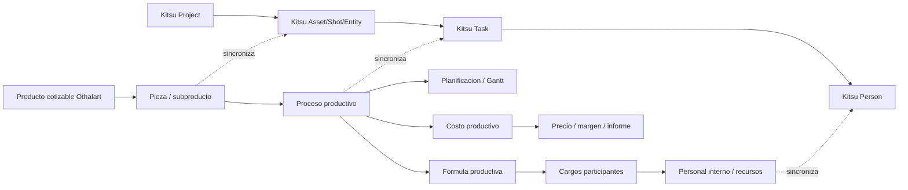

# Arquitectura Othalart

Este documento fija la direccion tecnica del Cotizador Othalart despues de revisar el estado actual de la app WinForms y los proyectos open source Kitsu/Zou.

## Decision Estrategica

La app WinForms actual queda definida como **prototipo funcional y motor economico/productivo**. No debe seguir creciendo como unica fuente de interfaz, gestion de produccion, Gantt, asignaciones, bibliotecas y exportacion al mismo tiempo.

La estrategia acordada es:

1. **Fork first**: evaluar Kitsu/Zou como base real para gestion de produccion.
2. **Reuse first**: reutilizar entidades, tareas, personas, estados, previews, comentarios y permisos existentes.
3. **Integrate second**: integrar el motor Othalart como servicio/adaptador economico.
4. **Adapt third**: adaptar UI y flujos solo donde Kitsu/Zou no cubran la necesidad.
5. **Scratch only if necessary**: crear desde cero solo las piezas propias del cotizador, ecuaciones, precios, rentabilidad y propuesta comercial.

## Estado Actual Del Sistema

La app actual contiene valor real en estas capas:

- **Bibliotecas JSON**: productos, etapas, subetapas, ecuaciones productivas, rendimientos, cargos, personal, gestiones y moneda.
- **Motor productivo**: desglose interno desde productos/subproductos, ecuaciones, cargos participantes, rendimientos y dias-persona.
- **Motor economico**: costos internos, costos extra, moneda, escenarios, resultados, margen e informe.
- **Planificacion**: Gantt, subetapas, propuesta a etapas y plan de mano de obra.
- **Persistencia de proyecto**: guardar/cargar cotizacion con bibliotecas asociadas.

La deuda principal es que muchas pantallas son a la vez UI, editor, validador, motor de calculo y persistencia. Eso aumenta bugs de sincronizacion.

## Regla De Capas

Desde ahora, los cambios nuevos deben respetar esta separacion:

1. **Dominio Othalart**
   - Modelos y reglas puras.
   - No conoce WinForms.
   - No dibuja controles.

2. **Bibliotecas**
   - JSON editables.
   - Cargan, validan y guardan datos maestros.
   - No calculan UI.

3. **Motor De Calculo**
   - Convierte productos y parametros en desglose, tiempos, costos y recomendaciones.
   - Consume bibliotecas.
   - Devuelve diagnosticos cuando faltan datos.

4. **Adaptadores**
   - Traducen entre WinForms, JSON local y eventualmente Kitsu/Zou.
   - Mantienen compatibilidad con proyectos antiguos.

5. **Interfaz**
   - Solo presenta, edita y dispara acciones.
   - No debe contener formulas de negocio nuevas.

## Fuente De Verdad

| Concepto | Fuente de verdad actual | Fuente objetivo |
| --- | --- | --- |
| Producto cotizable | `productos2d.json` | Othalart, sincronizable a Kitsu como production template |
| Pieza/subproducto | `productos2d.json` | Othalart product breakdown, mapeable a Kitsu entity/task |
| Etapa/subetapa | `etapas.json`, `subetapas.json` | Othalart + Kitsu task types/departments |
| Formula productiva | `ecuaciones_productivas.json` | Othalart engine |
| Rendimiento | `rendimientos_productivos.json` | Othalart engine |
| Cargo | `cargos.json` | Othalart engine + Kitsu departments/roles |
| Persona interna | `personal_empresa.json` | Kitsu persons con extension Othalart |
| Asignacion | Proyecto Othalart | Kitsu task assignment + Othalart allocation metadata |
| Estado/seguimiento | WinForms/Gantt actual | Kitsu/Zou |
| Precio/rentabilidad | Othalart | Othalart |
| Informe comercial | Othalart | Othalart |

## Frontera Del Motor Othalart

El motor Othalart debe conservar y aislar:

- Calculo de desglose productivo.
- Ecuaciones productivas y formulas madre.
- Rendimientos por cargo/proceso.
- Dedicacion por cargo participante.
- Costos internos por cargo/persona.
- Costos extra e impuestos.
- Escenarios minimo, estandar y holgado.
- Precio ofertable, margen y utilidad.
- Diagnosticos de datos faltantes.

Kitsu/Zou no reemplazan este motor. Kitsu/Zou reemplazan o complementan gestion de produccion, seguimiento, asignaciones, estados, colaboracion y revision.

## Entidades Objetivo

## Principios Para Nuevas Funciones

- Toda biblioteca editable debe tener servicio JSON, modelo y validacion.
- Toda pantalla que edite JSON debe tener boton de guardado visible y feedback.
- Todo calculo debe devolver diagnosticos, no ceros silenciosos.
- Los identificadores deben ser estables; los nombres visibles pueden cambiar.
- Las dependencias entre procesos deben ser explicitas; no inferidas por orden salvo fallback documentado.
- La UI nunca debe ser la unica fuente de datos.
- Las asignaciones de personas deben venir desde necesidades productivas, no desde tablas manuales sueltas.

## Estado De Compatibilidad

No se ha copiado codigo de Kitsu/Zou al producto. Los repositorios fueron clonados localmente solo para auditoria en `.codex-audit/`.

Como Kitsu y Zou declaran licencia AGPL-3.0, cualquier fork, copia de codigo o derivado distribuido debe revisarse con obligaciones AGPL antes de publicarse.

## Primer Adaptador Implementado

Se agrego una primera frontera compilable de integracion:

- `Models/Integrations/OthalartUpstreamDraft.cs`
- `Services/Integrations/OthalartKitsuZouMappingService.cs`

Esta capa **no conecta aun con Kitsu/Zou por HTTP**. Su funcion es convertir una `Cotizacion` actual en un borrador neutral con forma de:

- project,
- entities,
- tasks,
- assignments,
- warnings.

Ese borrador es el contrato previo para integrar con Zou sin contaminar WinForms ni el motor economico con detalles de API externa.
